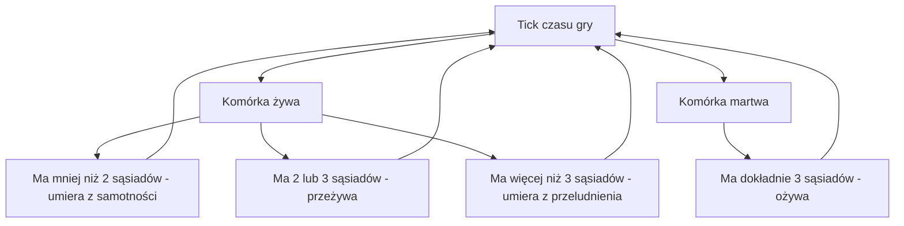

# Game of Life

Program implementuje automat komórkowy (The Game of Life) wymyślony przez Johna Conwaya w 1970 roku.

## Opis Automatu

Symulacja ma miejsce w tablicy o wymiarach zadanych przez użytkownika, której krawędzie są sklejone, tzn. jeżeli komórka próbuje przemieścić się do pola wykraczającego poza rozmiar tablicy, to pojawia się po drugiej stronie tablicy, jakby była ona zwinięta w torus. Dzięki temu symulacja może działać w sposób ciągły, a granice tablicy nie stanowią bariery dla przemieszczających się komórek.

Pole w siatce reprezentującej tablicę ma dwa możliwe stany:
- **Zamalowane** (pole zasiedlone przez komórkę)
- **Niezamalowane** (pole niezasiedlone przez komórkę)

Co interwał czasu z przedziału 10 ms do 1 s, określony przez użytkownika, obliczany jest następny stan automatu według następujących zasad:

1. Każda komórka wchodzi w interakcję z 8 polami, z którymi sąsiaduje (4 boki i 4 wierzchołki).
2. Każda komórka, która sąsiaduje z mniej niż dwiema innymi komórkami, umiera. - **Zasada niewystarczającej populacji**
3. Każda żywa komórka z dwoma lub trzema sąsiadami nie zmienia swojego stanu - **Zasada zachowania populacji**
4. Każda żywa komórka z więcej niż trzema sąsiadami umiera - **Zasada nadmiernej populacji**
5. Jeżeli niezasiedlone pole ma dokładnie 3 żywych sąsiadów, to zostaje zasiedlone żywą komórką.

## GUI

Program posiada prosty interfejs graficzny wykonany w Tkinter, umożliwiający:

* Zmianę rozmiaru siatki.

* Rozpoczęcie i zatrzymanie symulacji.

* Wyczyszczenie siatki (wszystkie komórki stają się martwe).

* Ustawienie losowego układu żywych komórek na siatce.

* Zmianę szybkości symulacji (parametr tick).

# [Uruchamianie]

Program uruchamia się z terminala polceniem  `Python GOL.py`

